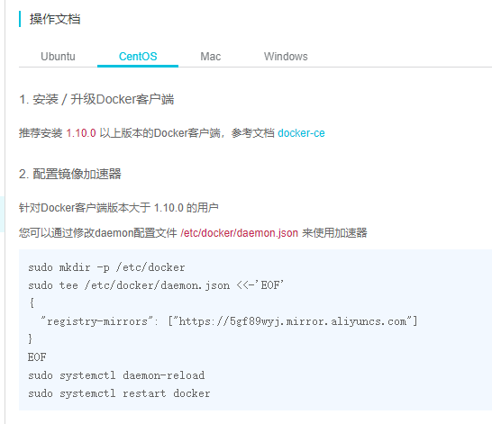

# 闻乎开发环境搭建笔记

[TOC]

# 0、前言

选用环境为：

1. Nginx
2. MySQL
3. Redis
4. ElasticSearch
5. Nacos

CentOS选择8.0，64位


## 1、Docker

### 1.1、移除环境已有Docker

```bash
$ sudo yum remove docker \
                  docker-client \
                  docker-client-latest \
                  docker-common \
                  docker-latest \
                  docker-latest-logrotate \
                  docker-logrotate \
                  docker-engine
```

### 1.2、使用存储库安装

安装`yum-utils`软件包（提供`yum-config-manager` 实用程序）并设置**稳定的**存储库。

如果速度较慢，可选择阿里云的镜像源

```bash
$ sudo yum install -y yum-utils

$ sudo yum-config-manager \
    --add-repo \
    https://download.docker.com/linux/centos/docker-ce.repo
```

### 1.3、安装DOCKER引擎

```bash
sudo yum install docker-ce docker-ce-cli containerd.io
```

### 1.4、启动Docker

```bash
systemctl start docker
```

### 1.5、测试--运行hello-world

```bash
docker run hello-world
```

### 1.6、阿里云镜像加速

#### 1.6.1、登录

#### 1.6.2、打开控制台

#### 1.6.3、选择容器镜像服务

#### 1.6.4、选择镜像加速器

#### 1.6.5、配置使用



```shell
sudo mkdir -p /etc/docker
# 一部分一部分执行
sudo tee /etc/docker/daemon.json <<-'EOF'
{
  "registry-mirrors": ["https://5gf89wyj.mirror.aliyuncs.com"]
}
EOF

sudo systemctl daemon-reload
sudo systemctl restart docker
```

### 1.7、修改Docker服务文件

Docker开启远程访问

vim /lib/systemd/system/docker.service

```shell
将文件内的 ExecStart注释。 新增如上行。
#ExecStart=/usr/bin/dockerd -H fd:// --containerd=/run/containerd/containerd.sock
ExecStart=/usr/bin/dockerd  -H tcp://0.0.0.0:2375 -H unix:///var/run/docker.sock
```

重新启动docker

```
systemctl daemon-reload
systemctl start docker
```


# 1、Nginx

1.创建本地目录

```
mkdir -p /data/nginx/html /data/nginx/logs /data/nginx/conf
```

2.运行

临时nginx

```
docker run -d --name nginx  -p 82:80 nginx
复制文件 docker cp nginx:/etc/nginx/ /data
```


```
docker run -d --name my_nginx  -p 81:80 -v /data/nginx/logs:/var/log/nginx -v /data/nginx:/etc/nginx -v /data/nginx/html:/usr/share/nginx/html  nginx
```

# 2、MySQL

1.下载mysql

```
docker pull mysql:8
```

2.启动

> MySQL版本选择8.0

```
docker run -p 3306:3306 --name my_mysql -e MYSQL_ROOT_PASSWORD=123456 -d mysql:8
```


# 3、Redis

## 3.1、下载Redis

下载链接：https://download.redis.io/releases/redis-6.0.tar.gz

```
docker pull redis:6
```


## 3.2、启动Redis

1.直接启动Redis

```
docker run --name my_redis -d -p 6379:6379 -d redis:6 --requirepass "123456"
```

2.使用自己修改后的redis.conf启动redis

主redis：

```shell
docker run -it --name redis_6379 -v /data/redis/redis_6379/redis_6379.conf:/usr/local/etc/redis/redis.conf -d -p 6379:6379 redis:6 redis-server /usr/local/etc/redis/redis.conf
```

从redis

```shell
docker run -it --name redis_6380 -v /data/redis/redis_6380/redis_6380.conf:/usr/local/etc/redis/redis.conf -d -p 6380:6379 redis:6 /usr/local/etc/redis/redis.conf
```

```shell

```


# 4、ElasticSearch

1.下载

```
docker pull elasticsearch:7.6.2
```

2.运行

```
docker run -d --name my_elasticsearch  -p 9200:9200 -p 9300:9300 -e "discovery.type=single-node" elasticsearch:7.6.2
```

3.安装elasticsearch-head

两种方式安装，一种为chrome插件，一种为下载前端应用连接

3.安装ik分词器插件

```
docker exec -it elasticsearch /bin/bash
```

```
./bin/elasticsearch-plugin install https://github.com/medcl/elasticsearch-analysis-ik/releases/download/v7.6.2/elasticsearch-analysis-ik-7.6.2.zip
```

安装后进入/usr/share/elasticsearch/plugins查看插件

4.重启elasticsearch

5.测试ik分词器

http://192.168.228.66:9200/_analyze   POST

```
{"analyzer":"ik_smart","text":"好好爱学习"}  #最少划分
{"analyzer":"ik_max_word","text":"好好爱学习"}  #最小粒度划分
```


# 5、Nacos

> nacos官网：https://nacos.io/zh-cn/docs/quick-start-spring-cloud.html

## 5.1、Docker下载

```bash
docker pull nacos/nacos-server:1.4.1
```

## 5.2、Docker安装

```
docker run -d -p 8848:8848  --env MODE=standalone  --name my_nacos  nacos/nacos-server:1.4.1
```


```bash
docker run -d -p 8848:8848 -e JVM_XMS=256m -e JVM_XMX=256m --env MODE=standalone  --name my_nacos  nacos/nacos-server:1.4.1
```

## 5.3、验证是否安装成功

> 地址：http://127.0.0.1:8848/nacos
>
> 账号：nacos
>
> 密码：nacos

